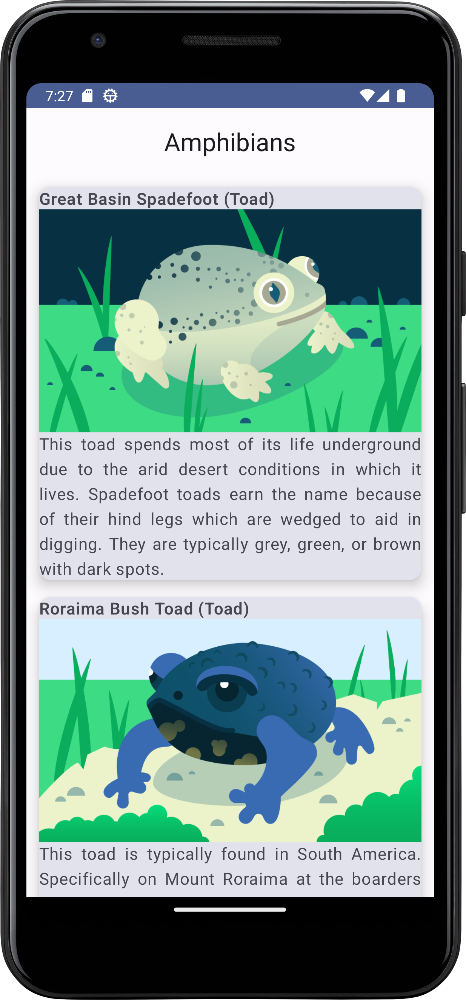

Amphibians
==========

Amphibians app is an app that uses retrofit to access data stored on a Web server
as a REST web service.

This app demonstrated the use of [Retrofit](https://square.github.io/retrofit/) to make REST 
requests to the web service, [kotlinx.serialization](https://github.com/Kotlin/kotlinx.serialization)
to handle the deserialization of the returned JSON to Kotlin data objects, and
[Coil](https://coil-kt.github.io/coil/) to load images by URL.

Concepts applied
----------------
- Composable functions
- Modern architecture including; viewModel
- Coroutines for long-running tasks
- Clean architecture by separating the network calls into a repository
- Use the Coil library used to load and display photos from the internet in the app
- Use of Retrofit to make REST requests to the web server

Pictures of the final app
-------------------------

